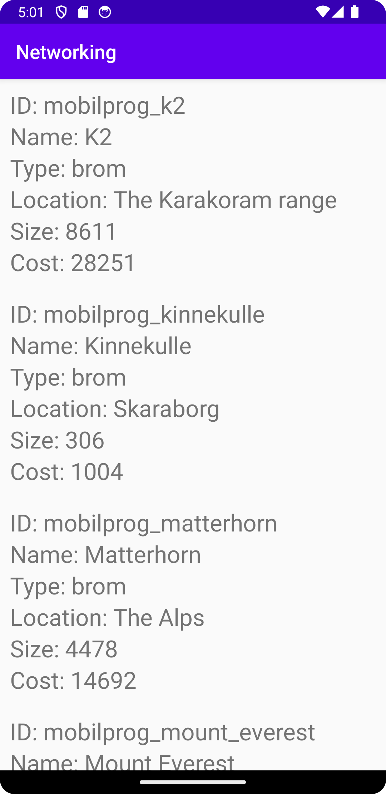
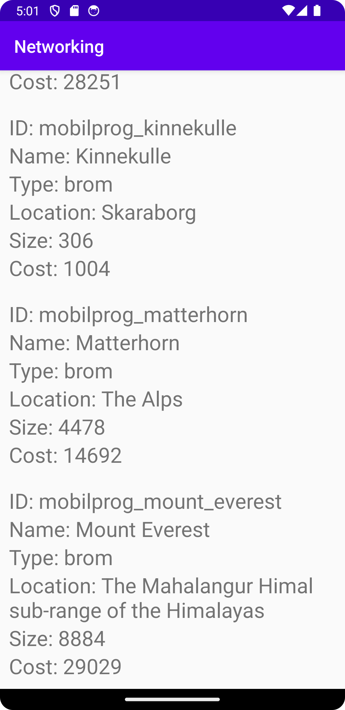

# Rapport

**Recycler List**

```
...
public class MainActivity extends AppCompatActivity implements JsonTask.JsonTaskListener {
    
    // JSONTask does checking if JSON_URL is validate, network and then active the function onPostExecute().
    private final String JSON_URL = "https://mobprog.webug.se/json-api?login=brom";
    ...
    
    @Override
    protected void onCreate(Bundle savedInstanceState) {
        ...
        new JsonTask(this).execute(JSON_URL);
    }
    
    @Override
    public void onPostExecute(String json) {
        ...
    }
}
```
Först en fil måste skapas Mountain.java som innehåller alla properties för att hämta data från MainActivity.java. MainActivity har en URL som innehåller all data och lagras i en variabel JSON_URL.
JSON_URL lagras i en parameter till funktionen JSONTask(this).execute() och sedan skickas till funktionen onPostExecute() som tar emot en parameter JSON.

```
@Override
public void onPostExecute(String json) {
    
    // Check if JSON is not NULL
    try {
        // Take JSON-data and turn into an array
        JSONArray arr = new JSONArray(json);
        
        // Take a Mountain class which can hold of arrays
        ArrayList<Mountain> mountains = new ArrayList<>();
        
        // Each object get string of specific name and add each name on constructor from mountains.
        for (int i = 0; i < arr.length(); i++)
        {
            JSONObject object = arr.getJSONObject(i);

            String id = object.getString("ID");
            String name = object.getString("name");
            String type = object.getString("type");
            String location = object.getString("location");
            int size = object.getInt("size");
            int cost = object.getInt("cost");

            mountains.add(new Mountain(id, name, type, location, size, cost));
        }
    } catch (JSONException e) {
        Log.e("MainActivity==>","E:"+e.getMessage());
    }
}
```
Inuti onPostExecute() finns en "try"-block som kollar om JSON-string är null innan en JSONArray skapas.
JSONArray hämta JSON och används för att skapa en array som innehåller alla object. 
En for-loop används för att hämta varje objekt och lagra i varje property i en intans av Mountain-klassen genom att använda konstruktor.

```
    // RecyclerView grab recycler_view from activity_main.xml so att kan print data on the layout.
    RecyclerView recyclerView = findViewById(R.id.recycler_view);
    
    // Before showing data on the layout, must have an adapter which can bind data (mountains) and print out on the linear layout.
    adapter = new RecyclerViewAdapter(this, mountains);
    recyclerView.setAdapter(adapter);
    recyclerView.setLayoutManager(new LinearLayoutManager(this));
    
    // After that adapter send a message about data has changed.
    adapter.notifyDataSetChanged();
```
Denna kod skapar en RecyclerView som hämtar recycler_view från activity_main.xml för att visa data på layouten. 
Innan data visas måste ha en adapter för att binda datan (mountains) och skriva ut den på linear layouten.
Efter det adaptern har skickas ett meddelande om att datan har ändrats.


Här ser man hur den första aktiviteten ser ut, vilken kommer att visa varje data på layouten.


Här ser man hur det ser ut när man scrollar ner på layouten.

Läs gärna:

- Boulos, M.N.K., Warren, J., Gong, J. & Yue, P. (2010) Web GIS in practice VIII: HTML5 and the canvas element for interactive online mapping. International journal of health geographics 9, 14. Shin, Y. &
- Wunsche, B.C. (2013) A smartphone-based golf simulation exercise game for supporting arthritis patients. 2013 28th International Conference of Image and Vision Computing New Zealand (IVCNZ), IEEE, pp. 459–464.
- Wohlin, C., Runeson, P., Höst, M., Ohlsson, M.C., Regnell, B., Wesslén, A. (2012) Experimentation in Software Engineering, Berlin, Heidelberg: Springer Berlin Heidelberg.